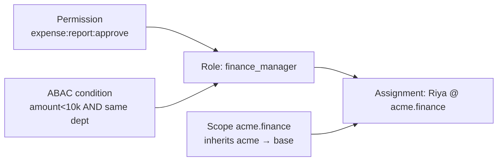
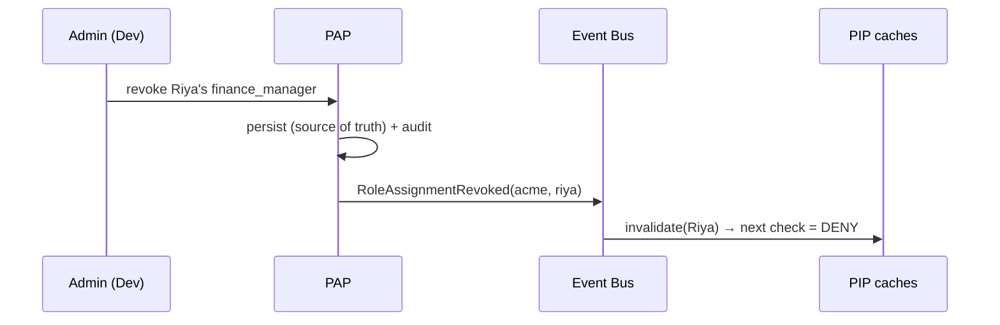
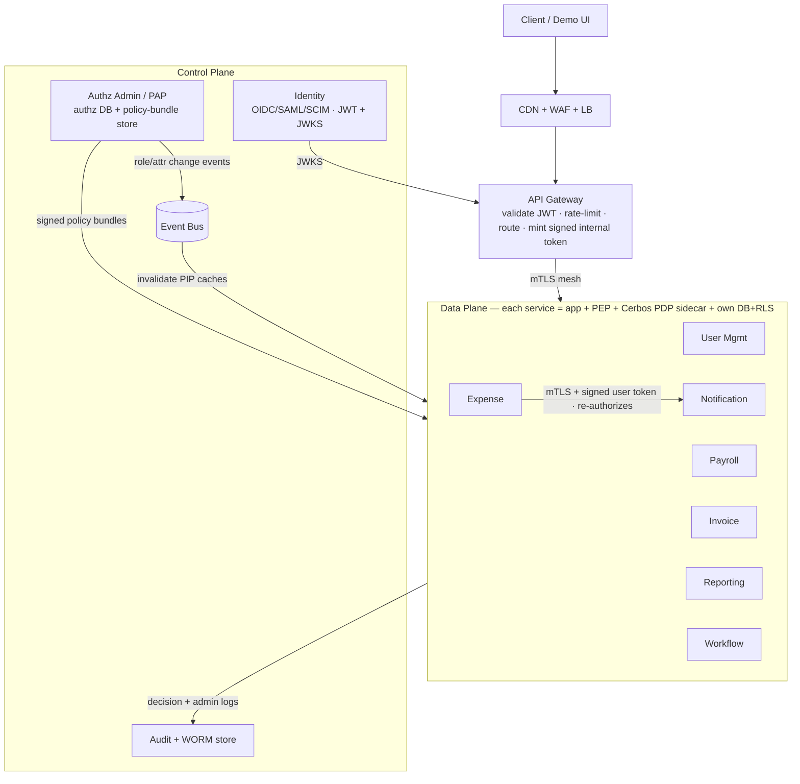
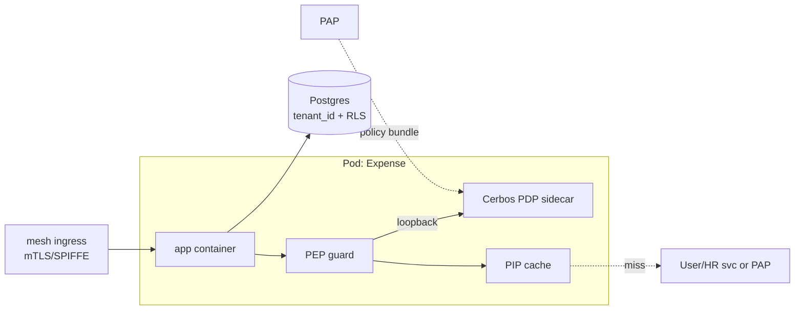
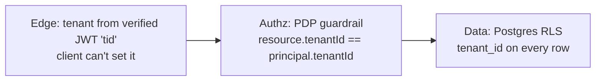
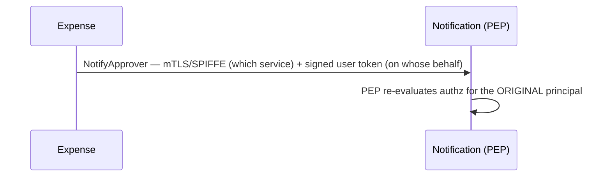
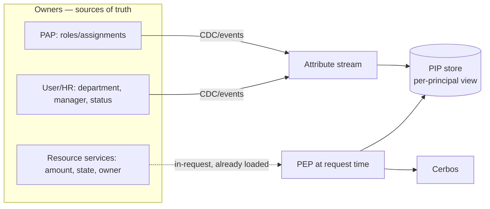

# Access Control Across Microservices in a Multi-Tenant Architecture
**Author:** Manas Srivastava · **Date:** 2026-06-06 · **Status:** Draft for review

> **Running example (used throughout):** Tenants **Acme** and **Globex** share the platform.
> In Acme: **Riya** = Finance Manager, **Sam** = Engineer, **Dev** = Org Admin.

---

## 1. Executive Summary

A central-logic / distributed-execution authorization system for a multi-tenant microservices SaaS.

- **Model:** hybrid **[RBAC + ABAC](#g-rbac)** with **hierarchical scopes** (org tree) — covers coarse roles, fine-grained conditions, and inheritance in one model. *(D1)*
- **Engine:** **Cerbos** as the **[Policy Decision Point](#g-pdp)** (stateless, YAML policies, [CEL](#g-cel) conditions, TS-first); **OpenFGA** is the documented alternative if relationship-graph traversal dominates. *(D2)*
- **Topology:** PDP runs **co-located (sidecar)**, not as a central service — authz sits on every request's hot path, so it must be local and sub-ms. *(D3)*
- **Tokens:** carry **identity + tenant only**; permissions are resolved **per-request** so revocation is near-instant. *(D4)*
- **Tenant isolation:** defense-in-depth — verified `tenant` claim at the edge, a PDP guardrail, and Postgres **[Row-Level Security](#g-rls)**; **pool+RLS** by default, **silo** as a paid tier. *(D5)*
- **Service-to-service:** **[mTLS/SPIFFE](#g-mtls)** (which service) + a **signed internal token** (on whose behalf) + **re-authorize at every hop** — defeats the **[confused-deputy](#g-deputy)** attack. *(D6)*
- **Identity:** **federated** (OIDC/SAML/SCIM); we own authorization, not identity. *(D7)*
- **Failure posture:** **fail-closed** on writes. *(D8)*

Full rationale for every decision (D1–D8): **§12**.

### Requirements traceability

| Brief requirement | Section | Brief requirement | Section |
|---|---|---|---|
| Functional / non-functional reqs | [§2](#s2) | APIs & data models | [§8](#s8) |
| High-level architecture | [§4](#s4) | Scalability & reliability | [§9](#s9) |
| Auth (authN/authZ) flow | [§5](#s5) | Security & compliance | [§10](#s10) |
| Multi-tenant isolation | [§6](#s6) | Operational concerns | [§11](#s11) |
| Access control model | [§3](#s3) | Assumptions/tradeoffs/justification | [§2.3](#s2-3), [§12](#s12) |
| Service-to-service security | [§7](#s7) | Dynamic role mgmt · Audit | [§3.4](#s3-4), [§10](#s10) |
| Attribute ownership (PIP) | [§3.5–3.6](#s3-5) | Governance · Multi-region · Audit · Attr-sourcing · Q&A | [A](#app-a)/[B](#app-b)/[C](#app-c)/[D](#app-d)/[E](#app-e) |
| Data & storage architecture | [§8.3–8.9](#s8-3) | Capacity · Event correctness · Migration | [App. F](#app-f) |

---

## 2. Requirements, NFRs & Assumptions <a id="s2"></a>

### 2.1 Functional requirements

| # | Requirement |
|---|---|
| FR-1 | Tenant lifecycle; each tenant is a hard isolation boundary |
| FR-2 | Federated identity (OIDC/SAML/SCIM); a user may belong to **multiple** tenants (distinct contexts) |
| FR-3 | Org hierarchy `Company→Department→Team` with permission inheritance |
| FR-4 | Tenant-defined roles bundling permissions `service:resource:action` |
| FR-5 | Fine-grained policies: attribute conditions (`amount<10k`, same-dept) + ownership/relationship rules |
| FR-6 | Uniform decision API: "can P do A on R?" → allow/deny **+ reason** |
| FR-7 | Cross-service authz: original principal re-evaluated at each hop |
| FR-8 | Dynamic role/permission/policy changes take effect in **seconds**, no redeploy |
| FR-9 | Immutable, tenant-scoped, tamper-evident audit of decisions + admin changes |
| FR-10 | Tenant self-service administration (the PAP) |

### 2.2 Non-functional requirements + capacity

```
10k tenants · 10M users · ~2M DAU · ~200 req/DAU/day
→ ~400M req/day ≈ 4,630 req/s avg · ~2 authz checks/req
→ ~9,300 authz checks/s avg · ~37,000/s peak (4×)
```

| NFR | Target | Why |
|---|---|---|
| Authz latency | p99 < 10 ms (local), sub-ms typical | on every request's hot path |
| Authz availability | 99.99% | authz down = platform down → drives co-located PDP (D3) |
| Change propagation | < 5 s | "dynamic role management" (FR-8) |
| Tenant isolation | zero cross-tenant access | existential for fintech |
| Audit | no decision lost; immutable | SOC 2 / regulatory |

### 2.3 Assumptions & scope <a id="s2-3"></a>

**Assumptions** *(each is a discussion point)*
1. Identity is **federated, not owned** — tenants bring Okta/AD/Azure AD.
2. Authorization is **centralized in logic, distributed in execution**.
3. **Cloud-native** (Kubernetes + mesh) deployment is available.
4. Dominant pattern is **role + attribute with bounded relationship depth** (org tree, ownership) — *not* deep recursive sharing graphs. **This is the key premise behind choosing Cerbos over OpenFGA (D2).**
5. **Single-region for v1**, with data-residency hooks designed in.

**Out of scope:** all 7 services fully built (we build a focused slice, §13) · building an IdP/MFA · billing · end-user UI · infra hardening beyond the authz path · multi-region active-active *implementation* (designed in App. B).

---

## 3. Access Control Model <a id="s3"></a>

**Hybrid (RBAC + ABAC) with hierarchical scopes** — no mature enterprise uses a pure model; they layer roles with attribute conditions.

1. **RBAC base** — tenant roles bundle permissions (`expense:report:approve`). Fast, coarse.
2. **ABAC conditions** — attribute rules on permissions (`amount<10000`, `resource.department == principal.department`, `owner == principal`). Fine-grained (FR-5).
3. **Hierarchical scopes** — roles/policies scoped to an org node (`acme.finance.emea`), evaluated most-specific-first with inheritance (FR-3).



### 3.1 The rule, as actual Cerbos policy

```yaml
resourcePolicy:
  resource: "expense_report"
  scope: "acme.finance"                 # inherits acme.finance → acme → base
  rules:
    - actions: ["approve"]
      effect: EFFECT_ALLOW
      roles: ["finance_manager"]
      condition: { match: { all: { of: [
        { expr: "request.resource.attr.amount < 10000" },
        { expr: "request.resource.attr.department == request.principal.attr.department" } ] } } }
    - actions: ["*"]                     # base guardrail: tenant isolation
      effect: EFFECT_DENY
      roles: ["*"]
      condition: { match: { expr: "request.resource.attr.tenantId != request.principal.attr.tenantId" } }
```

### 3.2 PDP / PEP / PAP / PIP

| Role | Our impl | Property |
|---|---|---|
| **[PDP](#g-pdp)** (decide) | Cerbos sidecar | stateless, sub-ms, deterministic |
| **[PEP](#g-pep)** (enforce) | NestJS guard per service | assembles input, **fails closed** |
| **[PAP](#g-pap)** (administer) | Authz Admin Service + Git-backed policies | strongly consistent, low QPS |
| **[PIP](#g-pip)** (inform) | local cache of authz data + resource owner | event-invalidated attributes |

### 3.3 Engine choice (rationale → D2)

| Criterion | **Cerbos ✓** | OpenFGA | OPA / Oso / Casbin |
|---|---|---|---|
| Model | RBAC+ABAC+scopes | ReBAC + Conditions | Rego / Polar / embedded |
| Org-tree inheritance | **native scopes** | tuples | manual |
| Conditional rules | **native CEL** | CEL ("some ABAC") | OPA strong; others vary |
| State | **stateless** | stateful tuple store | OPA stateless |
| TS SDK / demoability | **first-class / 1 container** | good / needs datastore | mixed |

*Switch to OpenFGA if Assumption #4 breaks (deep relationship graphs). Caveat: no head-to-head benchmarks survived verification; Oso/Casbin not independently verified.*

### 3.4 Dynamic management (FR-8) <a id="s3-4"></a>

Two change types, two channels — both effective in seconds, no redeploy, no waiting on token expiry:
- **Assignment change** (data) → PAP emits event → **PIP cache invalidated** → next check fetches fresh roles.
- **Policy change** (logic) → PAP **republishes bundle** → PDP hot-reloads.



### 3.5 Attribute ownership & the PIP (where `principal.department` lives) <a id="s3-5"></a>

ABAC is only as correct as its attributes, so ownership is explicit — each attribute has **one source-of-truth service**; the PIP is a *read-through cache*, never the owner.

| Attribute | Owner (source of truth) | Reaches the decision via |
|---|---|---|
| roles / assignments / scopes | **PAP** (authz DB) | change events → PIP cache |
| `principal.department`, manager, employment status | **User/HR service** (fed by SCIM) | `UserAttributesChanged` events → PIP cache |
| resource attrs (`amount`, `expense.department`, `owner`) | the **owning service** (Expense) | read by the PEP at request time — **always fresh** |

- Principal attrs are cached read-through with a hard TTL; a miss → synchronous fetch from the owner; **sensitive actions force a fresh read** (no cache).
- Resource attrs are **never cached** — the PEP loads them from its own DB in-request.
- So "Riya's department changed" originates in the **User/HR service**, whose event invalidates her PIP entry everywhere within the staleness bound (§9.1) — no ambiguous ownership, no silent stale attribute.

### 3.6 Authorization is a data-integration problem (the hardest part)

A single decision can need attributes from several owners (role ← PAP, department ← User/HR, amount/state ← resource service). Done naïvely this is a synchronous fan-out to N services per check — the real risk, and where Cerbos-style deployments struggle. We keep it off the hot path:
- **Resource attributes: in-request, zero fan-out.** The PEP already loaded the resource, so `amount`/`state`/`owner` are in hand.
- **Principal attributes: pre-materialized, not fetched.** Each owner streams changes (CDC/events) into the PIP, so at decision time the PEP reads **one local store**, never synchronously calls N services.
- **Policy-driven attribute schema.** Only attributes a tenant's policies actually reference are sourced — bounding the integration surface.
- **Per-attribute freshness SLA.** roles/assignments: seconds · department/employment: seconds–minutes · volatile resource state: in-request.
- **Deeply relational attributes** (manager-of-manager-of-owner, recursive sharing) are the **OpenFGA/ReBAC pivot** (Assumption #4): Cerbos consumes a *denormalized* relationship attribute (e.g. precomputed `management_chain`), not a live graph traversal.

Net: the hot path stays **PEP (resource in hand) + PIP (local) + PDP (local)**; fan-out is amortized into an async materialization pipeline. Full pipeline, the worked "Can Alice approve Invoice 42?" trace, and analytics-plane isolation: **Appendix D**.

---

## 4. High-Level Architecture <a id="s4"></a>

Two planes: a **control plane** (manage authz — slow, strongly consistent, low-QPS) and a **data plane** (evaluate authz — fast, eventually-consistent, high-QPS). **Every business service has the same shape:** app + [PEP](#g-pep) + a co-located [PDP](#g-pdp) + its own tenant-scoped DB.

### 4.1 Logical view (whole system)



### 4.2 Anatomy of one service (how it actually runs — Kubernetes)



### 4.3 Request lifecycle (end to end)
1. **Client → Edge → Gateway:** TLS terminate; validate JWT via JWKS; extract `sub` + `tid`; rate-limit; mint a **signed internal identity token**.
2. **Gateway → service** over the mTLS mesh.
3. **PEP** loads the resource (with `tenantId`, attrs) from the service's own DB; runs the cheap **tenant guardrail**.
4. **PEP → PIP** for the principal's roles/attrs (local cache; miss → fetch from owner, §3.5).
5. **PEP → PDP** (Cerbos, loopback): `check(principal, resource, action)` → ALLOW/DENY + reason.
6. **Cross-service** (e.g. Expense → Notification): the callee's PEP **re-runs 3–5** for the original principal — no implicit trust.
7. **Audit** receives the decision (async); response returns to the client.
8. **Out of band:** PAP pushes policy bundles to every PDP and emits change events → PIP caches invalidate (§3.4, §9.1).

### 4.4 Components & which requirements each serves

| Component | Responsibility | Serves |
|---|---|---|
| Edge (CDN/WAF/LB) | TLS, DDoS/WAF, load-balance | availability, DoS |
| API Gateway | validate JWT (JWKS), inject context, rate-limit, route — **authN only** | FR-2 |
| Identity Service | short-lived tokens; federate IdPs (OIDC/SAML); SCIM | FR-2, D7 |
| Authz Admin (**PAP**) | source of truth: tenants, hierarchy, roles, permissions, policies; publishes bundles; emits events | FR-1,3,4,5,10 |
| **PEP** (per service) | assemble input, enforce, fail-closed | FR-6,7 |
| **PDP** (Cerbos sidecar) | decide allow/deny + reason | FR-5,6 |
| **PIP** (cache + owners) | supply principal/resource attributes | FR-5, §3.5 |
| 7 business services | own their domain + data (Postgres + RLS) | the platform |
| Event Bus | propagate role/policy changes | FR-8 |
| Audit (+ WORM) | immutable decision/admin log | FR-9, App. C |

---

## 5. Authentication & Authorization Flow <a id="s5"></a>

**LDAP/AD is *not* the core.** AuthN ("who are you") is LDAP's job; AuthZ ("what may you do") is ours. A tenant's directory is a **federated identity source** (OIDC/SAML/SCIM); authorization stays in our system. *(D7)*

**Token** (JWT, `RS256`, ~5 min): carries `sub`, `tid` (tenant — set by IdP, never the client), `sid`. **No permissions in the token** — resolved per-request (D4).

**Multi-tenant users:** a token represents **one *active* tenant context**, not all memberships. At login/tenant-switch the user picks an active tenant and the IdP issues a token with that single `tid`; switching re-issues a token with a new `tid` and a fresh permission resolution. So *Alice-as-Acme-Admin* and *Alice-as-Globex-Viewer* are two distinct contexts — never blended in one decision.

```mermaid
sequenceDiagram
    participant U as Riya
    participant GW as Gateway
    participant EXP as Expense (PEP)
    participant PIP
    participant PDP as Cerbos
    participant AUD as Audit
    U->>GW: POST /expenses/42/approve (JWT)
    GW->>GW: validate JWT (JWKS) → sub, tid
    GW->>EXP: forward + signed identity context
    EXP->>EXP: load expense (tenantId, amount, dept); guardrail tenant check
    EXP->>PIP: Riya's roles + dept
    PIP-->>EXP: [finance_manager], dept=finance
    EXP->>PDP: check(principal, resource, approve)
    PDP-->>EXP: ALLOW (finance_manager ∧ amount<10k ∧ same dept)
    EXP->>AUD: log decision (+reason, trace-id)
    EXP-->>U: 200
```

Deny path is identical; PDP returns `DENY`+reason → PEP returns `403`, still audited.

---

## 6. Multi-Tenant Isolation <a id="s6"></a>

**Three layers, never one check:**



**Data isolation — tiered (pool default, silo paid):**

| Model | Isolation | Cost @10k tenants | Use |
|---|---|---|---|
| **Pool** (shared DB + RLS) | logical | **lowest** | default |
| Bridge (schema/tenant) | medium | medium | noisy-neighbor mitigation |
| Silo (DB/tenant) | physical | highest | regulated/residency tier |

**Footguns avoided:** `tid` never from client input · OpenFGA isolation = single store + contextual tuples (*not* store-per-tenant) · cross-tenant users = distinct per-tenant contexts (Riya@acme ≠ accountant@globex). *(D5)*

**Beyond OLTP — the analytics plane.** RLS protects transactional DBs, but reporting/ETL/BI/data-lakes routinely bypass it (the most common real-world tenant leak). Isolation therefore extends to the data pipeline: `tenant_id` carried into the warehouse; warehouse row/column security (or per-tenant datasets); the **Reporting service is itself a PEP-guarded service**; ETL runs under a constrained identity with mandatory tenant tagging; every export is authorized + audited. *(Detail: App. D.4.)*

---

## 7. Service-to-Service Security <a id="s7"></a>

Two identities travel on every internal call; the callee **re-authorizes** rather than trusting the caller. *(D6)*



**Confused-deputy avoided:** plaintext identity headers are forgeable, so we (a) never trust them, (b) sign the propagated context (OWASP "Passport" pattern; token-exchange RFC 8693), (c) re-authorize at each hop.

**User- vs system-initiated calls** (cost + correctness): each re-authorization is **local** (PDP sidecar + PIP cache, sub-ms) — a deep call chain adds bounded *local* cost, not a network fan-out. **User-initiated** chains propagate the original principal and re-authorize every hop. **System-initiated** work (scheduled payroll run, async workflow steps) runs under a **constrained service identity** with a narrow service role — not an impersonated user — so it never triggers per-user re-auth fan-out. The propagated token's `act` claim marks which mode applies.

---

## 8. APIs, Data & Storage Models <a id="s8"></a>

```mermaid
erDiagram
    TENANT ||--o{ ORG_UNIT : has
    TENANT ||--o{ ROLE : defines
    USER ||--o{ MEMBERSHIP : "joins via"
    TENANT ||--o{ MEMBERSHIP : has
    ROLE ||--o{ ROLE_PERMISSION : grants
    PERMISSION ||--o{ ROLE_PERMISSION : in
    MEMBERSHIP ||--o{ ROLE_ASSIGNMENT : has
    ROLE ||--o{ ROLE_ASSIGNMENT : assigned
    ORG_UNIT ||--o{ ROLE_ASSIGNMENT : "scoped to"
    TENANT ||--o{ POLICY : owns
    TENANT { uuid id; enum isolation_tier }
    ORG_UNIT { uuid id; uuid parent_id; string path }
    MEMBERSHIP { uuid id; uuid user_id; uuid tenant_id; jsonb attributes }
    ROLE { uuid id; uuid tenant_id; string key; string scope }
    PERMISSION { uuid id; string key }
    ROLE_ASSIGNMENT { uuid id; uuid role_id; uuid scope_org_unit_id }
    POLICY { uuid id; string scope; jsonb rule; int version }
```
Every business table also carries `tenant_id` + RLS (§6).

### 8.1 API conventions
All calls: `Authorization: Bearer <JWT>` + `Content-Type: application/json`. **Tenant is read from the token `tid`, never the body.** Mutations require an `Idempotency-Key` header and use **optimistic concurrency** — reads return an `ETag`; writes must send `If-Match`, and a stale write gets `409` (prevents lost updates when two admins edit the same role). Paths are versioned (`/v1/`); lists use cursor pagination (`?limit=&cursor=`). The **`/pdp` decision API is internal-only** (service-mesh, never exposed at the public gateway). The reference impl ships a full **OpenAPI 3.1 spec** (refresh flow, `429 Retry-After`, etc. live there).

**Status codes:** `200/201` ok · `400` validation · `401` unauthenticated · `403` authz denied · `404` · `409` conflict · `429` rate-limited.
**Error envelope (every 4xx/5xx):**
```json
{ "error": { "code": "forbidden", "message": "human-readable text",
             "reason": "the rule/condition that failed",
             "decisionId": "dec_a1b2", "traceId": "trc_9f" } }
```

### 8.2 Core contracts (request → response)

**Authenticate**
```http
POST /auth/token
{ "grant_type":"password", "username":"riya@acme.com", "password":"•••", "tenant":"acme" }
→ 200 { "access_token":"eyJ…", "token_type":"Bearer", "expires_in":300, "refresh_token":"rt_…" }
→ 401 { "error":{ "code":"invalid_credentials", "message":"Email or password is incorrect" } }
```

**Create role (PAP)**
```http
POST /admin/v1/roles                         Authorization: Bearer <admin>
{ "key":"finance_manager", "scope":"acme.finance",
  "permissions":["expense:report:read","expense:report:approve"] }
→ 201 { "id":"role_7f3", "tenantId":"tenant_acme", "key":"finance_manager", "scope":"acme.finance",
        "permissions":["expense:report:read","expense:report:approve"], "version":1,
        "createdAt":"2026-06-06T10:00:00Z" }
```

**Assign / revoke role** (revoke drives the dynamic-change demo, FR-8)
```http
POST   /admin/v1/role-assignments
{ "userId":"user_riya", "roleKey":"finance_manager", "scope":"acme.finance.emea" }
→ 201 { "id":"asg_91", "userId":"user_riya", "roleKey":"finance_manager", "scope":"acme.finance.emea" }

DELETE /admin/v1/role-assignments/asg_91     If-Match: "asg_91:v3"
→ 204   (emits RoleAssignmentRevoked → PIP cache invalidated within seconds)
```

**Publish / roll back policy (PAP)** — versioned & stageable
```http
POST /admin/v1/policies
{ "scope":"acme.finance", "rule":{…}, "effectiveDate":"2026-07-01T00:00:00Z" }
→ 201 { "id":"pol_5", "scope":"acme.finance", "version":7, "status":"staged" }

POST /admin/v1/policies/pol_5/rollback   { "toVersion":6 }
→ 200 { "version":8, "rolledBackTo":6 }
```

**Decision API — the uniform check (FR-6) · internal, mesh-only**
```http
POST /pdp/v1/check
{ "principal": { "id":"user_riya", "roles":["finance_manager"],
                 "attr":{ "tenantId":"tenant_acme", "department":"finance" } },
  "resource":  { "kind":"expense_report", "id":"exp_42",
                 "attr":{ "tenantId":"tenant_acme", "amount":8500, "department":"finance" } },
  "actions": ["read","approve","delete"] }              # bulk: many actions in one call
→ 200 { "decisionId":"dec_a1b2",
        "results":[ { "action":"read",    "effect":"ALLOW" },
                    { "action":"approve", "effect":"ALLOW", "policy":"expense_report/acme.finance",
                      "reason":"finance_manager ∧ amount<10000 ∧ same department" },
                    { "action":"delete",  "effect":"DENY",  "reason":"no rule grants delete" } ] }
# "which resources can Riya approve?" → Cerbos PlanResources / OpenFGA ListObjects (App. A)
```

**Business action via PEP — allow & deny**
```http
POST /expenses/exp_42/approve                Authorization: Bearer <riya>
{ "comment":"approved for Q2" }
→ 200 { "id":"exp_42", "status":"approved", "approvedBy":"user_riya", "decisionId":"dec_a1b2",
        "at":"2026-06-06T10:05:00Z" }

POST /expenses/exp_99/approve                # amount 25000
→ 403 { "error":{ "code":"forbidden", "message":"Cannot approve this expense",
                  "reason":"condition failed: amount<10000",
                  "decisionId":"dec_c3d4", "traceId":"trc_9f" } }

POST /expenses/exp_glx/approve               # belongs to Globex
→ 403 { "error":{ "code":"forbidden", "message":"Resource not in your tenant",
                  "reason":"tenant isolation guardrail", "decisionId":"dec_e5", "traceId":"trc_a1" } }
```

**List (cursor pagination pattern)**
```http
GET /expenses?status=pending&limit=20&cursor=eyJ…    Authorization: Bearer <riya>
→ 200 { "items":[ { "id":"exp_42", "amount":8500, "department":"finance", "status":"pending" } ],
        "nextCursor":"eyJ…" }
```

### 8.3 Database choice — why PostgreSQL <a id="s8-3"></a>

The authz source of truth and financial data demand **ACID + strong consistency** (a permission read that's wrong is a security hole; money must not be eventually consistent). PostgreSQL, **one DB per service**:

| Need | Postgres feature |
|---|---|
| Strong consistency for roles/policies/money | ACID; serializable where needed |
| Relational authz model (user→role→perm→scope) | joins, FKs, constraints |
| Tenant isolation in the data layer | **Row-Level Security** |
| Flexible principal/resource attrs & policy rules | **JSONB** (+ GIN) |
| Org-tree traversal | **`ltree`** + recursive CTEs |
| Feed the PIP materialization + audit | **logical replication / CDC** (Debezium) |
| Scale horizontally when needed | **Citus** (distributed PG) / declarative partitioning |

**Rejected:** document/KV stores (Dynamo/Mongo) — eventual consistency at the *source of truth* for permissions is unsafe and the model is relational; **graph DB** (Neo4j) — only justified under a ReBAC pivot, where the *engine* (OpenFGA/SpiceDB) owns the graph, not our DB. **Cerbos needs no DB** (stateless; policies live in Git/bundles), so there is no separate authz-engine datastore to operate.

### 8.4 Storage topology, tenant scaling & the skew problem

- **DB-per-service** (not one shared DB): independent scaling/failure, clear ownership.
- **Within a service:** pool = shared schema + `tenant_id` + RLS (default, §6). Scale path: vertical → read replicas → **shard by `tenant_id`** (Citus; the tenant is the shard key, so a tenant's rows co-locate — no cross-shard joins).
- **Tenant skew (50 vs 500k users):** solved by **tenant-aware placement** — whale tenants get a dedicated shard or the **silo** tier (§6); the long tail shares pooled shards; a rebalancer relocates tenants as they grow. So `WHERE tenant_id=?` never hot-spots one node for a whale.
- **Partitioning:** large tables (`memberships`, audit) partitioned by `tenant_id` (hash) and/or time (`pg_partman`).
- **Regional:** tenant home-region (App. B); one cluster per region.

### 8.5 Org-hierarchy storage (the `acme.finance.emea` question)

| Option | Read subtree | Reorg / move | Verdict |
|---|---|---|---|
| Adjacency list (`parent_id`) | recursive CTE | cheap | keep for integrity |
| **Materialized path (`ltree`)** | **indexed prefix (`<@`)** | rewrite subtree | **primary** |
| Closure table | fast, extra table | heavy writes | overkill here |
| Nested sets | fast | brutal writes | no |

**Decision: `ltree` materialized path** (primary, GiST-indexed) **+ `parent_id`** (integrity). Scopes *are* paths (`acme.finance.emea`), so this maps 1:1 to Cerbos scopes and gives indexed subtree queries. **Reorg** (move finance under corporate) = rewrite that subtree's paths in one transaction — bounded and rare; reads (hot path) dwarf reorgs. **Depth-bounded** (≤8) to cap traversal; **cycles impossible** (it's a tree); **mergers** = re-parent a subtree.

### 8.6 Hot queries & complexity

| Query | Plan | Complexity |
|---|---|---|
| Get user's roles | index `(tenant_id, user_id)` | O(log n) + O(k), k = roles/user (small) |
| Inherited perms for a scope | `ltree` ancestors + join | O(depth), depth ≤ ~8 |
| Decision (Cerbos) | CEL over the scoped policy set | O(rules on scope chain) |
| **List authorized rows** | §8.8 | pushed into SQL, not N checks |

**Key indexes:** `role_assignments(tenant_id,user_id)` & `(tenant_id,role_id)` · `org_unit` GiST(path) · `roles(tenant_id,key)` unique · `memberships(tenant_id,user_id)` unique + GIN(attributes) · `policies(tenant_id,scope,version)`. **The hot path runs none of these per request** — principal attrs are pre-materialized into the PIP (§3.6).

### 8.7 Policy, cache & audit storage

- **Policy logic:** authored as code in **Git** → CI compiles + tests → **signed, versioned bundles** in **object storage (S3)** → Cerbos PDPs **pull** bundles (immutable, checksummed, staged rollout). The PAP DB holds only policy *metadata* (scope, version, `effectiveDate`).
- **PIP cache:** **L1 in-process LRU** (hot path, no network hop) + optional **L2 Redis** (regional, amortizes misses across pods). Invalidation = event + TTL ceiling; **single-flight on miss + jittered TTL** prevent cache stampede / thundering herd.
- **Audit:** **never** in the OLTP DB. PEPs emit decisions → **Kafka** (durable buffer, absorbs bursts/backpressure) → **S3 Parquet with Object-Lock/WORM** (immutable compliance log) **+ ClickHouse** (queryable hot index for the "why-denied" explainer); cold-tier per retention. This is what makes the ~3.2B-events/day volume (§10) tractable.

### 8.8 Authorization-aware queries (the "list" problem)

"Show all invoices Alice can approve" can't fetch-all-then-check at scale. We use **Cerbos `PlanResources`**: it returns a **query plan** (a boolean filter) for the principal + action, which the service **compiles into a SQL `WHERE` predicate** (via the ORM) and pushes into the query — so the DB returns only authorized rows, combined with the always-on tenant RLS. (ReBAC pivot: OpenFGA `ListObjects`.) This keeps list/search endpoints both correct and fast.

### 8.9 Database reliability

Per cluster: **primary + synchronous standby** (RPO ≈ 0 for the authz/financial source of truth) **+ async read replicas** (read scaling, RPO ~seconds). **Quorum-based automated failover** (Patroni / managed PG) with fencing → no split-brain; **RTO < ~30 s**. Kafka RF = 3; S3 + cross-region replication for audit/DR (App. B).

---

## 9. Scalability & Reliability <a id="s9"></a>

- **Distributed PDP** (sidecar over loopback) → no central bottleneck; identical policy → identical decisions. Turns ~37k peak checks/s into a local sub-ms op. *(D3)*
- **PIP caching** of principal attrs, event-invalidated (staleness < 5 s) — removes a per-request network lookup.
- **Decision caching** optional, short TTL keyed by `(principal, resource-version, action)`. *(Caveat: OpenFGA had a conditions+caching CVE — caching must be correctness-tested.)*
- **Stateless** services + PDPs scale horizontally.

| Failure | Detection | Recovery | Posture |
|---|---|---|---|
| PDP unreachable | health/error rate | restart; PEP retries local | **fail-closed** (writes) |
| PIP stale/miss | cache metrics | refetch from PAP | bounded staleness; deny on hard miss (sensitive) |
| PAP down | health check | PDPs keep last bundle | eval continues; admin paused |
| IdP/JWKS down | error rate | cache JWKS | reject new logins, honor valid tokens |
| DB primary loss | replica lag | promote replica | RLS still enforced |

### 9.1 Consistency model
**Consistency contract (stated precisely):** authorization is **strongly consistent at the source of truth** (the PAP write is durable at once) but ***eventually* consistent at enforcement**, bounded by the PIP TTL. We do **not** claim a change is globally instant — only *durably recorded immediately* and *enforced everywhere within the TTL ceiling*. The event bus is a latency **optimization, not a correctness dependency**: if it's down, correctness still holds via TTL-expiry + synchronous re-fetch.
- **Bounded staleness:** every PIP entry has a TTL (≈5 s); change events invalidate sooner, but the TTL is the *guaranteed* ceiling even if an event is missed.
- **Read-your-writes (admins):** PAP writes are synchronous to the source of truth and the admin UI reads from the PAP (not a cache), so an admin always sees their own change.
- **Event-bus outage (e.g. 2 h):** entries **expire at TTL** → each check does a **synchronous fetch from the owner** (degraded latency, correct decisions); a revocation committed to the PAP is enforced within the TTL even with the bus down.
- **Transient cross-service divergence:** two services *can* briefly reach different decisions for the same principal if their PIP/bundle versions differ — bounded by TTL + bundle-version monitoring (§9.2); for money-movement actions we force fresh reads to eliminate it.
- **Sensitive actions** (payroll run, policy edit) bypass cache entirely (fresh read).

**Failure-posture matrix** (defines the read path explicitly):

| Action class | cache hit | miss + owner up | miss + owner **down** |
|---|---|---|---|
| write / sensitive (approve, payroll, policy edit) | fresh read | sync fetch | **fail-closed (deny)** |
| normal read | serve within TTL | sync fetch | serve last-known until TTL, then **deny** |
| low-risk read (list own items) | serve | sync fetch | serve stale + flag degraded |

### 9.2 PDP fleet at scale (the sidecar cost)
A sidecar per pod across ~200 services is real overhead. Mitigations:
- **Node-local PDP** (DaemonSet) instead of per-pod sidecar — one Cerbos per node amortizes memory across that node's pods; still a loopback/UDS call. Default once service count is high.
- **Bundle versioning + staged rollout:** each bundle is versioned; PDPs report the loaded version; rollout is canary→fleet; **version skew is a monitored, alerting metric**.
- Cerbos's footprint is small and policies are scope-selected, so per-instance cost stays bounded.

### 9.3 Policy / role growth
Eval cost does **not** grow with total policy count: Cerbos selects the *scoped* resource policy (`acme.finance`), so a tenant with 1,000 policies still evaluates only those on the resource's scope chain. Role explosion (500 roles) is contained by **role hierarchy / derived roles**, not flat enumeration; PIP assignment lookups are indexed.

### 9.4 Multi-region & DR
Designed in **Appendix B** (regional PDP/PIP replicas, tenant home-region pinning, cross-region audit). Implementation deferred from v1.

---

## 10. Security & Compliance <a id="s10"></a>

**STRIDE (authz path):**

| Threat | Mitigation |
|---|---|
| Spoofing | mTLS/SPIFFE + signed internal token (§7) |
| Tampering | `tid` from IdP only; permissions resolved server-side (§5) |
| Repudiation | hash-chained immutable audit |
| Info disclosure | 3-layer isolation incl. RLS (§6) |
| DoS | per-tenant quotas; pool blast-radius limits |
| Elevation of privilege | re-authorize every hop (§7) |
| Token replay | short-lived + `jti`/nonce + audience binding; **sender-constrained tokens** (mTLS-bound / DPoP) so a stolen token is useless off its client |
| Secret/key compromise | JWT keys rotate via JWKS overlap (no downtime); mTLS = short-lived **auto-rotated SVIDs** (SPIRE); DB creds = vault **dynamic secrets** |
| Insider threat | least privilege + **SoD on admin roles** (App. A) + **dual-control** for sensitive policy edits; break-glass is time-boxed + alerted |

**Privileged access monitoring (PAM):** every admin / break-glass action emits a high-priority audit + real-time alert; anomaly detection watches per-tenant allow/deny ratios.

**Trust boundary — the honest-service assumption (compromised-service threat).** The PDP trusts resource attributes supplied by the PEP — but the PEP is the resource's **owning** service reading its **own** DB. A compromised Invoice service could already tamper with invoices it owns, so this is a **blast-radius/containment** problem, not an authz *bypass*. Cross-boundary attributes (principal roles) come from the **PIP — materialized from PAP/HR, never from the caller** — so a compromised service cannot grant *itself* roles. Defense in depth: mTLS/SPIFFE restricts who may call whom, least-privilege service identities, audit + anomaly detection, and owner-signed amounts for money-movement. Full protection against a service lying about its *own* resource needs runtime attestation — acknowledged, out of scope for v1.

**Audit (FR-9) — tiered by volume.** Logging *every* ALLOW would be ~3.2B events/day at peak (37k/s × 86.4k) — untenable, so audit is split:
- **Compliance log (always, immutable):** all DENY, all admin/PAP changes, all break-glass, and all ALLOW on **money-movement / sensitive classes** (payroll, invoice/expense approve).
- **Security log (sampled + adaptive):** low-risk ALLOWs sampled (~1%), auto-escalating to **full capture when a tenant's deny-ratio spikes** (attack/misconfig).

Both are append-only, hash-chained (tamper-evident), tenant-scoped, linked by `trace-id`, IDs-not-payloads. Storage (WORM), retention (SOX ~7 yr), export, GDPR-vs-immutability → **Appendix C**.

**Compliance:** SOC 2 (access control + audit + change mgmt) · PCI-DSS (card data tokenized/out-of-scope) · GDPR (per-tenant export/erasure; residency via silo tier). Encryption in transit (mTLS) + at rest; vault-managed secrets + rotation.

---

## 11. Operational Concerns <a id="s11"></a>

| Concern | Approach |
|---|---|
| Monitoring | PDP RED metrics; **allow-vs-deny ratio per tenant** (spike = misconfig/attack); cache hit-rate; bundle-propagation lag |
| Tracing | W3C trace-context gateway→service→PDP; each `decisionId` linked to a trace |
| Debugging | "**why denied?**" — Cerbos returns the deciding rule; admin **decision-explainer** replays a check showing scope chain + condition results |
| Policy safety | policies as code: Git-versioned, peer-reviewed, CI-tested vs the canonical cases (§13), staged, instant rollback |
| Multi-tenancy | per-tenant quotas/rate-limits contain noisy neighbors |

---

## 12. Tradeoffs & Decisions (rationale lives here) <a id="s12"></a>

| # | Decision | Chosen | Rejected | Why |
|---|---|---|---|---|
| D1 | Model | hybrid RBAC+ABAC+scopes | pure RBAC/ABAC/ReBAC | coarse + fine-grained + hierarchy; matches real practice |
| D2 | Engine | **Cerbos** | OpenFGA, OPA, Oso, Casbin | native scopes + CEL, stateless, TS-first, demoable; OpenFGA if relationship-graph dominates |
| D3 | PDP topology | co-located sidecar | central PDP service | avoids hot-path network latency; no bottleneck |
| D4 | Permissions in token? | **No**, per-request | embed in JWT | dynamic revocation; avoids stale-JWT footgun |
| D5 | Data isolation | pool+RLS default; silo tier | DB-per-tenant for all | cost at 10k tenants; physical isolation as a tier |
| D6 | S2S trust | mTLS/SPIFFE + signed token + re-auth | plaintext headers | defeats confused-deputy |
| D7 | Identity | federate (OIDC/SAML/SCIM) | own IdP / LDAP-as-core | separate AuthN from AuthZ |
| D8 | Failure posture | fail-closed (writes) | fail-open | fintech: deny beats leak |

---

## 13. Reference Implementation (executable slice)

Depth over breadth (reasoning is graded above line count). Node/TS + NestJS:

- **Gateway** (JWT/JWKS) · **Identity** (mock login → real JWTs; federation seams documented) · **Authz Admin/PAP** (tenants, roles, assignments; publishes Cerbos policies; emits events) · **Expense service** with **PEP guard → Cerbos sidecar** · **Audit** (hash-chained) · **Postgres + RLS** · **Demo UI** (below) · **docker-compose** + seed (Acme/Globex, Riya/Sam/Dev).

**Demo UI — minimal client** (Vite + React + TS, ~3 screens; maps to "Client" in §4). A thin front-end to the Gateway that **never makes authz decisions** — it only reflects them.
- **Login / user switch:** pick Riya / Sam / Dev (seeded) → receives a JWT.
- **Expenses:** list + Approve buttons → render the server's **200 ✓ / 403 ✗ with the PDP's reason**.
- **Admin (Dev only):** revoke/grant Riya's role → switch to Riya, retry → decision **flips in seconds** (FR-8 live).
- **Decision-log panel:** last allow/deny + reason + `decisionId` (mirrors audit/explainer).
- **Security note (intentional):** hiding a button is **UX, not security** — the PEP/PDP is the real gate; the UI even *lets* you attempt a denied action to show the server's 403 (never trust the client).
- **Skipped to save time:** design system, responsive polish, real auth UX (MFA/reset), pagination, styling beyond a CSS-lite baseline (e.g. Pico.css via CDN).

**Tests = the canonical cases (executable proof):**
1. Riya approves $8.5k same-dept Acme expense → **200**
2. Riya approves $25k → **403** (ABAC)
3. Riya approves a Globex expense → **403** (isolation)
4. Sam reads Payroll → **403** (RBAC)
5. Dev revokes Riya's role → within seconds (1) → **403** (dynamic)
6. Forged identity header on internal call → ignored; re-auth denies (confused-deputy)

---

## 14. Future Work

Load-test benchmarks (Cerbos vs OpenFGA) · fuller Oso/Casbin bake-off · concrete RFC-8693 token-exchange in NestJS · multi-region active-active **implementation** (designed, App. B) · query-time ABAC filtering (App. A).

---

## 15. Glossary

The four authorization points (XACML model) — the spine of the design:

- <a id="g-pep"></a>**PEP — Policy Enforcement Point.** The "bouncer": intercepts a request, asks the PDP, and enforces the verdict. *Ours: a NestJS guard in each service.*
- <a id="g-pdp"></a>**PDP — Policy Decision Point.** The "judge": evaluates policy and returns ALLOW/DENY + reason. *Ours: Cerbos.*
- <a id="g-pap"></a>**PAP — Policy Administration Point.** Where policies and role data are authored/managed. *Ours: the Authorization Admin service.*
- <a id="g-pip"></a>**PIP — Policy Information Point.** Supplies the attributes a decision needs (principal roles, resource attributes). *Ours: an event-invalidated local cache + the resource's owning service.*

Access-control models & engines:

- <a id="g-rbac"></a>**RBAC / ABAC / ReBAC** — Role- / Attribute- / Relationship-based access control. We use a hybrid **RBAC + ABAC** (§3).
- <a id="g-cel"></a>**CEL** — Common Expression Language; the syntax for attribute conditions (e.g. `amount < 10000`) in Cerbos/OpenFGA.
- <a id="g-zanzibar"></a>**Zanzibar** — Google's relationship-based authorization system; the model **OpenFGA** implements.

Identity & service-to-service security:

- <a id="g-jwt"></a>**JWT / JWKS** — JSON Web Token (signed identity token) / the public key set used to verify its signature.
- <a id="g-oidc"></a>**OIDC / SAML / SCIM** — federation protocols for SSO (OIDC, SAML) and user provisioning (SCIM).
- <a id="g-mtls"></a>**mTLS** — mutual TLS; both sides present certificates, proving *which workload* is calling.
- <a id="g-spiffe"></a>**SPIFFE / SPIRE** — a standard (and its implementation) for issuing cryptographic *workload identities* to services.
- <a id="g-deputy"></a>**Confused deputy** — a privileged service tricked into acting on an attacker's behalf; prevented by re-authorizing at every hop (§7).

Multi-tenancy, data & operations:

- <a id="g-tenant"></a>**Tenant; pool / silo / bridge** — a customer org (the isolation boundary); the three data-isolation models (shared DB+RLS / DB-per-tenant / schema-per-tenant).
- <a id="g-rls"></a>**RLS** — Postgres Row-Level Security; the database filters rows by `tenant_id`, enforcing isolation at the data layer.
- <a id="g-stride"></a>**STRIDE** — threat-model taxonomy: Spoofing, Tampering, Repudiation, Information disclosure, Denial of service, Elevation of privilege (§10).
- <a id="g-qps"></a>**QPS / DAU / SLO** — queries per second / daily active users / service-level objective.

---

## Appendix A — Enterprise Governance & Advanced Patterns <a id="app-a"></a>

All expressible in the chosen model (Cerbos CEL conditions + derived roles); kept here so the core stays lean.

| Pattern | Need | How we model it |
|---|---|---|
| **Delegation** | Finance Manager on leave delegates approval | time-boxed **delegated grant** (assignment with `validUntil` + `delegatedBy`); PDP honors it only within the window |
| **Break-glass** | emergency payroll incident needs elevated access | a `break_glass` role: **self-service but time-boxed**, requires justification, raises a P1 audit + real-time alert (PAM), auto-expires |
| **Separation of Duties (SoD)** | SOX: invoice creator ≠ approver | policy condition `resource.createdBy != principal.id`; plus a **static SoD constraint** in the PAP blocking conflicting role combinations at assignment time |
| **Time-based** | approve only during business hours | CEL on request time: `now.getHours() >= 9 && now.getHours() < 18` |
| **Bulk evaluation** | UI "what can this user do?" / "which rows?" | `/pdp/v1/check` with multiple actions; **`PlanResources`** (Cerbos query plan) / OpenFGA `ListObjects` for "which resources" |

## Appendix B — Multi-Region & Disaster Recovery <a id="app-b"></a>

99.99% + 10M users implies more than one region; designed now, implementation deferred from v1.

- **Stateless tier (PDP/PEP/services):** active-active in every region; policy bundles are read-only and replicated to each region's PDP fleet.
- **Authz data (PAP) & PIP:** primary region + **async read replicas** per region; admin writes go to primary (read-your-writes preserved), reads served regionally.
- **Tenant home-region pinning:** each tenant has a home region (data residency / GDPR); requests route there; the silo tier can be region-locked.
- **DR:** RPO/RTO targets per data class; **audit replicated cross-region** (it's the compliance system of record); failover promotes a regional replica.
- **Consistency:** cross-region propagation widens the staleness window — acceptable because the **hard TTL + fail-closed** rule (§9.1) still holds per region.

## Appendix C — Audit Architecture (detail) <a id="app-c"></a>

| Concern | Design |
|---|---|
| **Storage / pipeline** | PEPs → **Kafka** (durable buffer) → **S3 Parquet with Object-Lock/WORM** (immutable compliance log) **+ ClickHouse** (queryable hot index for the explainer); cold-tier per retention. **Never in the OLTP DB** (§8.7) |
| **Immutability** | per-record `prev_hash` **hash chain**; chain head **periodically anchored** to external/WORM storage so tampering is detectable even by an insider with DB access |
| **Retention** | per-regulation (e.g. **SOX ~7 years** for financial actions); tiered to cold storage; per-tenant + per-event-class |
| **Export** | per-tenant signed **export API** for the tenant's own compliance / eDiscovery |
| **GDPR vs immutability** | the conflict (erasure vs an immutable log) resolved by storing **PII by reference (tokenized)**, never raw payloads; a GDPR erasure **crypto-shreds** the referenced PII (delete the key) while the tamper-evident audit record itself stays intact |
| **What's logged (tiered)** | **always:** all DENY, all admin/PAP changes, all break-glass, all ALLOW on money-movement classes · **sampled+adaptive:** low-risk ALLOWs (~1%, full-capture on deny-spike). All carry deciding rule + `decisionId`, linked by `trace-id` |

## Appendix D — Attribute Sourcing & Freshness (the hardest part) <a id="app-d"></a>

The biggest architectural risk: authorization quietly becomes a **data-integration problem**. How we contain it.

### D.1 Materialization pipeline (fan-out off the hot path)



Principal attributes are **streamed and materialized** into the PIP ahead of time; resource attributes arrive **in-request**. At decision time the PEP reads one local store + the in-hand resource — **no synchronous N-service fan-out**.

### D.2 Worked trace — "Can Alice approve Invoice 42?"

| Attribute needed | Owner | Sourced via | Freshness |
|---|---|---|---|
| role = invoice_approver | PAP | event → PIP | seconds |
| principal.department, manager | User/HR | event → PIP | seconds–minutes |
| invoice.amount, .state, .createdBy | Invoice service | in-request (PEP) | live |
| SoD: createdBy ≠ Alice | derived in policy | CEL over the above | live |

One decision, four inputs, **zero synchronous cross-service calls** on the hot path.

### D.3 Freshness SLAs & PIP footprint
- **Per-attribute SLA:** roles/assignments ≤ 5 s · employment/department ≤ 60 s · volatile resource state = in-request (never cached).
- **PIP footprint (Q2):** the PIP caches the **active working set** (recently-seen principals), not all users — LRU + TTL. 100k active principals × a few KB ≈ low-hundreds of MB/node; a tenant's 1,000 roles doesn't enlarge a principal's entry (a user holds a handful of roles).

### D.4 Analytics-plane isolation (RLS is not enough)
RLS guards OLTP; warehouses/ETL/BI bypass it. Controls: `tenant_id` propagated into the warehouse; warehouse row/column security or per-tenant datasets; the **Reporting service is a PEP-guarded service**; ETL under a constrained identity with mandatory tenant tagging; every export authorized + audited.

### D.5 When this model breaks → ReBAC
If attributes become **deeply relational** (manager-of-manager-of-owner, recursive folder sharing), precomputing denormalized attributes gets expensive — that's the **OpenFGA/ReBAC pivot** (Assumption #4, D2).

## Appendix E — Architecture-Review Q&A <a id="app-e"></a>

Direct answers to the hard questions a staff reviewer asks.

**Q1 · Event bus down 2 h, role revoked — what happens?** The revoke is durably committed to the PAP immediately. PIP entries expire at TTL (≈5 s) and the next check **synchronously re-fetches** from the owner — so the revocation is enforced within the TTL despite the bus being down. Cost = higher read latency, not stale access (§9.1).

**Q2 · 1,000 roles, 100k users — PIP memory?** Caches the active working set (LRU+TTL), not all users; a principal entry holds only their handful of roles/attrs → low-hundreds of MB/node; role count doesn't bloat per-principal size (App. D.3).

**Q3 · Can two services reach different decisions for one request?** Transiently yes, if PIP/bundle versions differ within the staleness window — bounded by TTL + bundle-version monitoring, and **eliminated for money-movement actions via forced fresh reads** (§9.1).

**Q4 · Why Cerbos over OPA — operationally (not features)?** OPA is general-purpose (Rego; also k8s admission, infra policy) — powerful, but you build the app-authz ergonomics and learn Rego. Cerbos is purpose-built for app authz: typed request/response, built-in policy tests, decision-log/explain out of the box, YAML+CEL — **less to build and operate** here. OPA wins if we want one engine across infra + app policy.

**Q5 · manager-of-manager-of-owner?** Bounded depth → precompute a denormalized `management_chain` attribute, evaluate in Cerbos. Unbounded recursive traversal → **OpenFGA/ReBAC** (the documented pivot, D2 / App. D.5).

**Q6 · Stop audit becoming petabytes?** Tiered logging: always-log DENY + admin + break-glass + sensitive-class ALLOW; **sample low-risk ALLOWs (~1%) with adaptive full-capture on deny-spikes** (§10, App. C).

## Appendix F — Capacity Model, Event Correctness & Migration <a id="app-f"></a>

### F.1 Rough sizing (proving the numbers)
- **Authz checks:** 37k/s peak, evaluated **locally** (sidecar); Cerbos ~sub-ms, low CPU → each pod's PDP serves its pod's RPS; there is **no central authz QPS** to bottleneck.
- **DB QPS:** the hot path hits the **PIP cache, not the DB** → DB load = materialization writes + cache misses (≪ 37k/s).
- **PIP memory:** ~100k active principals × a few KB ≈ low-hundreds of MB/node (App. D.3).
- **Audit:** ~3.2B events/day raw → tiered (§10) → Kafka (partitioned) → S3 Parquet (hundreds of GB–TB/day compressed) + ClickHouse hot window.
- **Policy bundles:** KB–MB, pulled + cached per PDP.

### F.2 Correct eventual consistency (events do fail)
- **Idempotency + ordering:** every change carries a **monotonic per-entity version**; a consumer applies it only if `incoming.version > stored.version` → duplicates, out-of-order, and replays are absorbed (e.g. a reordered `grant v3` arriving after `revoke v4` is dropped).
- **Lost events:** the **TTL re-fetch backstop** (§9.1) guarantees convergence regardless of the bus.
- **Poison messages:** dead-letter queue + alert.
- **CDC source:** Postgres logical replication (Debezium) → ordered, at-least-once with offsets.

### F.3 Backpressure (mass change, e.g. 100k assignments)
Kafka buffers; consumers scale to drain; cache invalidation uses single-flight + jittered TTL (no stampede); PDP bundle rollouts are **staged/canary**, so a large policy change never hits the whole fleet at once.

### F.4 Authorization migration
Role-model / policy changes ship via **expand-contract**: a new policy version runs alongside the old; **bundle versioning** means each request evaluates against exactly one version (no mixed-version incorrectness); canary → fleet; instant rollback (§8.7). DB schema changes use expand-contract migrations.

---

**Primary sources:** Cerbos, OpenFGA, OPA docs · AWS Prescriptive Guidance (multi-tenant SaaS authz) · OWASP Microservices Security Cheat Sheet · RFC 8693 (token exchange) · Google Zanzibar paper.
